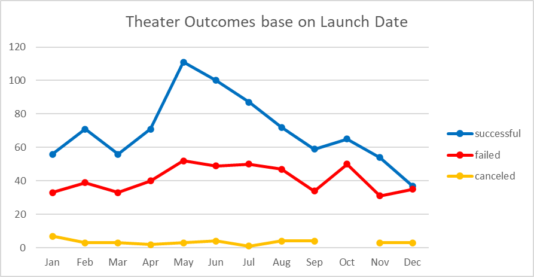
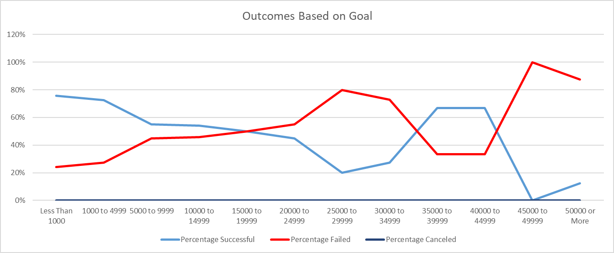

# Kickstarting with Excel

## Overview of Project

### Purpose

The client, Louise, had great success on Kickstarter armed with the previous analysis I conducted for her. She came back with
additional requests for further analysis. First, Louise wanted to find out how different campaigns performed relative to their 
launch dates. Second, she wanted to know how different campaigns fared relative to their funding goals.

## Analysis and Challenges

### Analysis of Outcomes Based on Launch Date

There was a clear winner regarding which month seemed best for launching a campaign on Kickstarter: May. There were a
total of 111 successful campaigns with launch dates in May between 2009 and 2017. June was a close second, with 100 successful
campaigns over the same period. The worst month for launching a campaign was December, with only 37 successful campaigns launching in
that month. Interestingly, May was also the month with the highest number of failed campaigns launching, a total of 52. It was also
interesting that the number of failed campaigns launching in December was almost the same as the number of successful campaigns
launching in that month.

### Analysis of Outcomes Based on Goals

I analyzed Kickstarter campaign outcomes based on their monetary goals by looking at the percentage of successful, failed, and
canceled campaigns across 12 goal-amount ranges, from less than $1000 to over $50000. There weren't any canceled campaigns to assess,
only successful and failed campaigns. Successful and failed campaings were mirror images of each other. The overall trend for
successful campaigns decreased as goal-amount ranges increased, and vice versa for failed campaigns.

### Challenges and Difficulties Encountered

The main challenge encountered was unfamiliarity with the =COUNTIFS formula in Excel, specifically trying to figure out how to
set the criteria for the goal-amount ranges in terms of greater than or equal to the min of the range and less than or equal to the max
of the range. Some searching in Excel help files, internet searches, and a video hint in Bootcamp Spot provided the necessary
information to complete the task.

## Results

- What are two conclusions you can draw about the Outcomes based on Launch Date?
Once conclusion is that, at least in our dataset, early summer (May/June) was the best time to launch a kickstarter campaign for plays.
A second conclusion is that the number of failed campaigns were consistent across the dataset; there weren't any times of year that
stuck out as bad months to launch a campaign.

- What can you conclude about the Outcomes based on Goals?
The data seemed to be bimodal for both percentage successful and percentage failed. The percent of successful campaigns were highest at
the low end of the goal-amount ranges (less than $1000 to $5000) and at the penultimate goal-amount ranges ($35000 - $45000). The
percentage of failed campaigns was highest at the $25000 to $35000 range and again at the higher end ($45000 and above).

- What are some limitations of this dataset?
The data were sparse from 2009 through 2013.

- What are some other possible tables and/or graphs that we could create?
The same analysis we did, but for individual countries; Outcomes vs amount pledged; Outcomes vs number of backers, etc.
